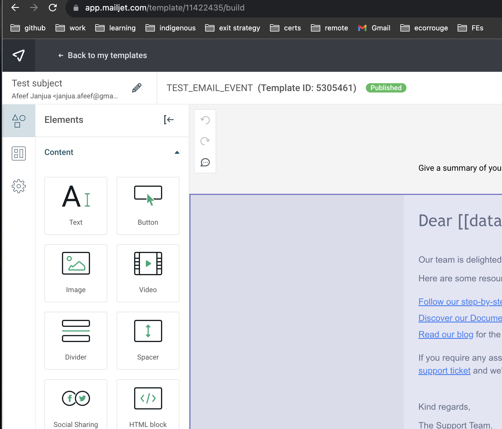
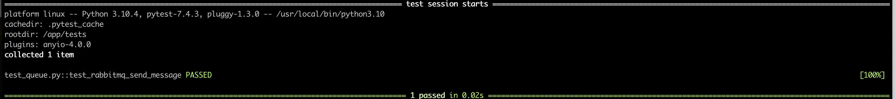
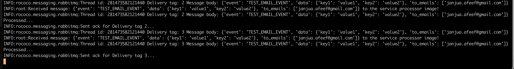
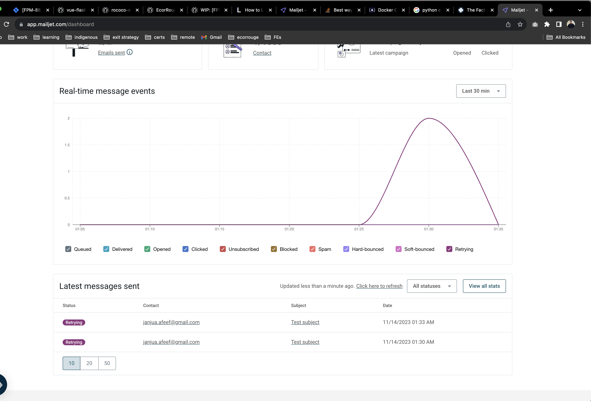

# email-transmitter
A general email transmitter that can use various services to send email

# Environment variables

The following instructions are for running the service standalone for testing and email verification

Copy `.env.example` file to `.env` file, Keep the EVs as-is, apart from the following three.

`EMAIL_PROVIDER="mailjet"` - This is where you provide the name of the email provider, currently, only `mailjet` is supported.

If you have selected `mailjet` as the email provider then, you have to fill in the following two EVs as well.

`MAILJET_API_KEY=`
`MAILJET_API_SECRET=`


# Config.json

Go to mailjet dashboard and create an email template. Give the template a name and publish it.

- Note the template ID and create an event in config.json. For example, I have created an email template like this



- And to send email using this template I have added the following event in the `src/config.json` file

```json
"TEST_EMAIL_EVENT": {
    "subject": "Test Subject",
    "templateName": "TEST_EMAIL_EVENT",
    "id": {
        "mailjet": 5305461
    }
},
```

# Docker & Docker Compose

A `docker-compose.yml` file is available in the code just for testing this service against rabbitmq. 
In practice, only the docker image of the service will be built & used

### Run services
- `docker-compose build --no-cache` - this will build the image from ground up 
using the latest `ecorrouge/rococo-service-host` base image.

- `docker-compose up -d` - this will run the `rabbitmq` & `email-transmitter` services

## Send test message to RabbitMQ
The `tests/test_queue.py` includes a simple test that will send a test email message to RabbitMQ

- To send a test email message to rabbitmq, please execute the following command
```shell
`docker exec -it email_transmitter poetry run pytest src/services/email_transmitter/tests`
```

If the message is delivered successfully to rabbitmq, the test will pass and you will the following output.


The above message from RabbitMQ will then be picked up my the `email_processor` to send the actual email. 
- Run the following command to see the logs of the `email-transmitter` and verify that it received the message, 
processed it, and sent an email using `mailjet` provider

```shell
docker compose logs email_transmitter
```
- You should see the following output


- Open your mailjet dashboard and verify that emails were sent to the corresponding users

